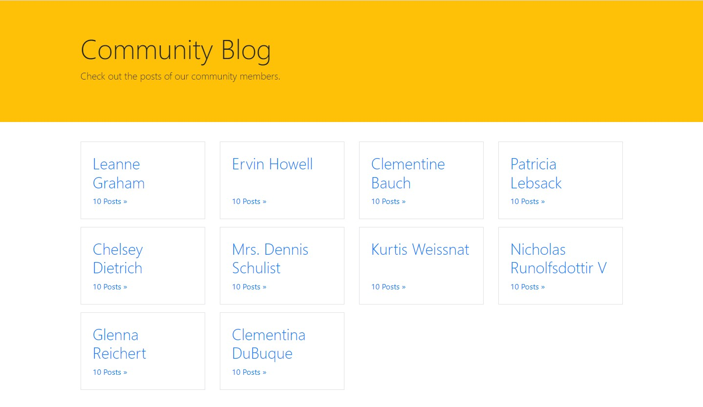
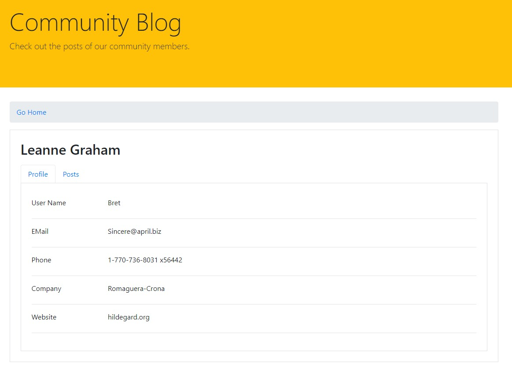
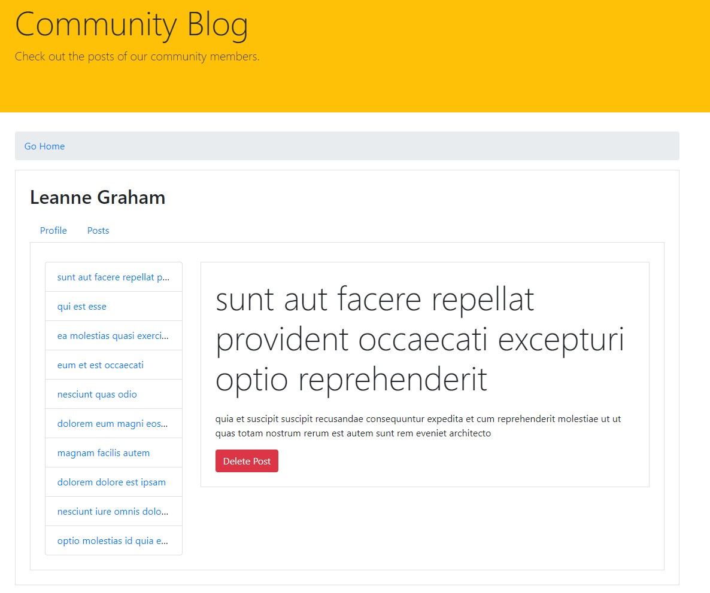

# Community Blog



## A demonstration of React Router v5 and other React concepts in the form of a simulated community blog. Currently deployed via Vercel. [Click here to view!](https://react-router-final-solution-assessment.vercel.app/)

### Home, Profile and Posts
The home view ```(i.e. /)``` only shows a list of users, as seen above. If you click on the user's name, it will bring you to the user's Profile view. If you click on the link underneath the user's name, it will bring you to the user's Posts view. The profile view ```(/users/:userId)``` shows a link to return to the home view and information about the user. 



The posts view ```(/users/:userId/posts)``` shows all the posts by the user. By default, it will show a message that says no post is selected.



## Below is a list of tools and concepts used to help implement this webpage

### Frontend Routing via React Router
React Router is the de facto library for keeping React UI in sync with the URL. It has a simple API with powerful features. When you're building your app in React, React Router can help you make the URL your first thought, rather than an afterthought. As the visitor navigates around the site, they expect the URL to change along with the content on the page. Frontend navigation offers many benefits:

- It allows visitors to bookmark pages.

- It allows visitors to share links to specific content and pages.

- It allows visitors to move forward and backward in their browsing history.

- Routing between views is generally faster than backend routing.

- Smooth transitions and animations between views are easier to implement.

- Breaking up your code by page helps promote modularity.

The ```<Route>``` component may be the most important component in React Router. Its responsibility is to render some UI when its path matches the current URL. Wrapping a component with ```<Route>``` is similar to wrapping it in an if statement. If the URL matches the path property of the route, the component will be rendered.

### The ```useParams()``` hook

The ```useParams()``` hook returns an object of key-value pairs of route parameters. You can use it to access the params of the current ```<Route>```.

### Programmatic navigation

It is common for a web application to automatically go to a different page in response to the visitor's actions. Most often, navigation is triggered by the user clicking a link. Yet, in some situations, the application needs to create, update, or delete some data *before* navigating to the new page. This can be implemented using programmatic navigation, which is navigation that causes a user to be redirected as a result of an event—such as logging in or saving—that occurs on a route

### Nested Routes

Sometimes, as the visitor navigates through the site, you want to change only a small part of the screen, not the entire page. The solution is to use nested routes to display more than one component at the same time. Nested routes, or child routes, are routes displayed inside of another route. This means that there can be more routes inside a component that is rendered by another route.

### The ```useRouteMatch()``` hook

The ```useRouteMatch()``` hook is useful any time that you need to get information about the closest matching ```<Route>``` in the tree. It includes the ```exact```, ```strict```, and ```sensitive``` options, as well as URL parameters.

### Frontend Deployment via Vercel

With Vercel, you can deploy web applications to the cloud for free using a single command. This website was deployed using Vercel.
